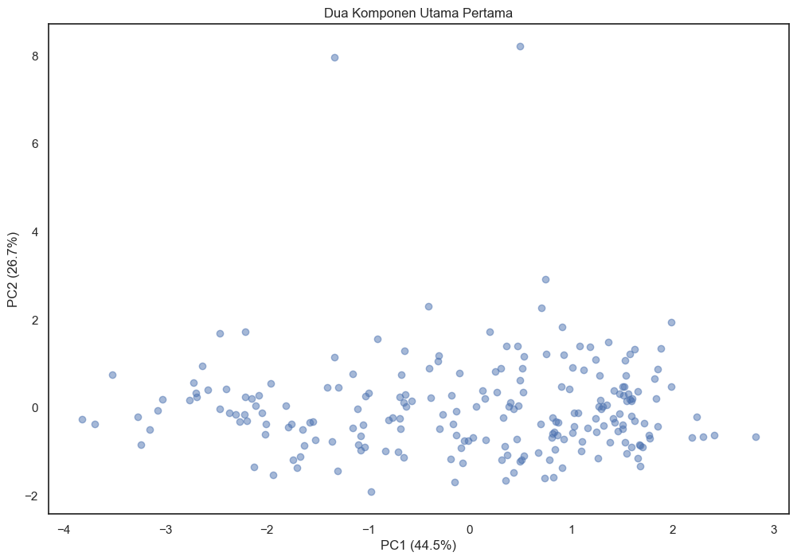

# <div align="center">🌍 World Population Insights: Exploratory Data Analysis (EDA)</div>

<div align="center">


📊 **Disajikan dalam:** Digital Skill Fair 39.0  
📄 **Dokumen Pendukung:** [EDA_Portfolio.pptx](./presentation/EDA_Portfolio.pptx)

</div>

---

## 📖 Overview

> Proyek ini merupakan **Exploratory Data Analysis (EDA)** yang bertujuan untuk mengungkap **pola dan tren populasi dunia**.  
> Fokus analisis mencakup **pembersihan data**, **deteksi outlier**, **korelasi antar variabel**, dan **dimensionality reduction** menggunakan **Principal Component Analysis (PCA)**.

---

## 📂 Project Structure

```plaintext
.
├── data
│   └── world_population2024.csv
├── notebooks
│   └── EDA_World_Population.ipynb
├── presentation
│   └── EDA_Portfolio.pptx
├── src
│   └── eda_analysis.py
└── README.md
```

---

## 📊 Dataset Information

- **File:** `world_population2024.csv`
- **Size:** 216 rows × 12 columns
- **Key Features:**
  - `Rank`
  - `Country (or dependency)`
  - `Population (2024)`
  - `Yearly Change`
  - `Net Change`
  - `Density (P/km^2)`
  - `Land Area (Km^2)`
  - `Migrants (net)`
  - `Fert. Rate`
  - `Med. Age`
  - `Urban Pop %`
  - `World Share`

---

## 📊 Exploratory Data Analysis (EDA)

<details>
  <summary><strong>📊 Klik untuk melihat detail eksplorasi data</strong></summary>

### 🧰 Libraries Used

| Library        | Purpose                            |
|----------------|-------------------------------------|
| `pandas`       | Data processing & manipulation      |
| `numpy`        | Numerical computations              |
| `matplotlib`   | Data visualization                  |
| `seaborn`      | Statistical graphics                |
| `scikit-learn` | PCA & StandardScaler                |

---

### 🧼 Data Cleaning

- ✔️ Tidak ada *missing values*  
- ✔️ Tidak ada duplikasi data  
- ✔️ Dataset siap untuk analisis lanjutan

---

### 🚨 Outlier Analysis

| Kolom           | Jumlah Outlier | Persentase |
|------------------|----------------|-------------|
| `Yearly Change`  | 5              | 2.31%       |
| `Fert. Rate`     | 5              | 2.31%       |
| `World Share`    | 23             | 10.65%      |

---

### 🔗 Correlation Analysis

| Variabel 1     | Variabel 2     | Koefisien Korelasi |
|----------------|----------------|---------------------|
| `Fert. Rate`   | `Med. Age`     | -0.87               |

---

### 📉 Principal Component Analysis (PCA)

- ✅ **Total variansi dijelaskan oleh 2 komponen pertama:** 71.26%  
- ✅ **Variabel dominan dalam PCA:**  
  `Rank`, `Fert. Rate`, `Med. Age`, `Urban Pop %`, `World Share`

</details>

---

## ✅ Recommendations & Next Steps

| Area Analisis     | Rekomendasi |
|-------------------|-------------|
| Korelasi          | Investigasi hubungan antar variabel |
| Segmentasi        | Identifikasi karakteristik tiap kelompok |
| Outlier           | Evaluasi apakah merupakan fenomena alami atau kesalahan data |
| Time Series       | Analisis tren populasi dari waktu ke waktu |
| Clustering        | Gunakan K-Means untuk menemukan pola |
| Predictive Model  | Bangun model prediktif berdasarkan hasil EDA |

---

## 📸 Visualization Example

<div align="center">
  
</div>

---

## 🚀 Getting Started

### 🔧 Prasyarat

- Python 3.x  
- Instalasi library yang dibutuhkan:
  
```bash
pip install pandas numpy matplotlib seaborn scikit-learn
```

---

### ▶️ Menjalankan Analisis

Gunakan Jupyter Notebook atau script Python:

```bash
python src/eda_analysis.py
```

---

## 🤝 Contributing

Ingin berkontribusi?

1. **Fork** repositori ini  
2. **Buat perubahan** yang dibutuhkan  
3. **Kirim Pull Request**  

Kontribusi Anda sangat kami hargai! 🙌

---

## 🛠️ Future Enhancements

- 🔹 Clustering dengan K-Means  
- 🔹 Time Series Analysis untuk prediksi tren populasi  
- 🔹 Feature Engineering untuk insight lanjutan  
- 🔹 Visualisasi yang lebih interaktif dan informatif  

---

## 📩 Contact

📧 **Email:** [febrianto078@gmail.com](mailto:febrianto078@gmail.com)  
💻 **GitHub:** [github.com/FBTO45](https://github.com/FBTO45)  
🔗 **LinkedIn:** [Febrianto](https://www.linkedin.com/in/febrianto/)

---

<div align="center">

🚀 **Silakan eksplor, kontribusi, atau berikan feedback pada proyek ini!**

</div>
